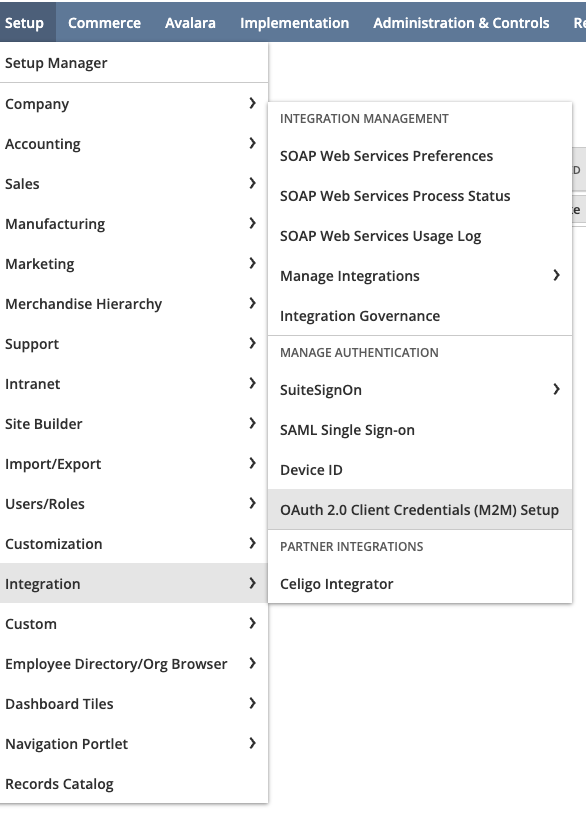
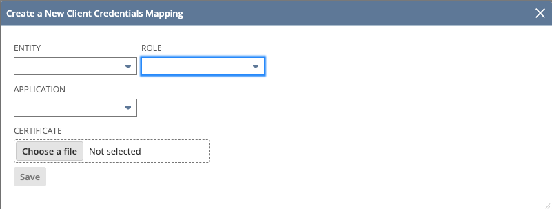
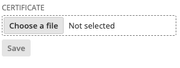
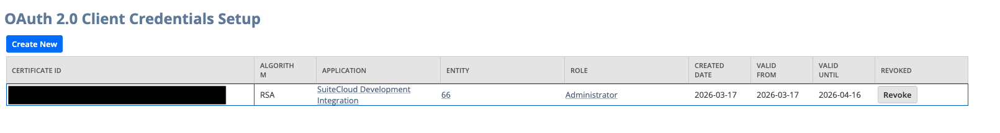

# NetSuite SDF M2M Setup

Configure NetSuite SuiteCloud Development Framework (SDF) with Machine-to-Machine (M2M) authentication via the SuiteCloud CLI.

> **Note:** This setup covers the CLI/console configuration, which is also a required prerequisite for using SDF from VS Code or Cursor. The IDE-specific setup for those editors is not covered in this document.

---

## Using the Claude Code skill (recommended)

Install the skill with a single command:

```bash
curl -o ~/.claude/commands/netsuite-sdf-m2m-setup.md \
  https://raw.githubusercontent.com/sinbidev/claude-skills/main/netsuite-sdf-m2m-setup/netsuite-sdf-m2m-setup.md
```

Then open Claude Code inside your SDF project and run:

```
/netsuite-sdf-m2m-setup
```

Claude will walk you through the entire setup automatically.

---

## Manual setup

If you prefer to do it manually, follow the steps below.

### Prerequisites

- Node.js and npm installed
- Access to a NetSuite account with admin or appropriate setup permissions
- An existing SDF project (for Steps 2–4)

---

### Step 0 — Install SuiteCloud CLI

Check if the CLI is already installed:

```bash
suitecloud --version
```

If not installed, run:

```bash
npm install -g @oracle/suitecloud-cli
```

---

### Step 1 — Set CI environment variables

Add the following exports to your `~/.zprofile`:

```bash
# NetSuite SDF M2M
export SUITECLOUD_CI=1
export SUITECLOUD_CI_PASSKEY=<your-random-alphanumeric-string-32-to-100-chars>
```

The `SUITECLOUD_CI_PASSKEY` must be between 32 and 100 alphanumeric characters. You can generate one with:

```bash
openssl rand -base64 48 | tr -dc 'A-Za-z0-9' | head -c 64
```

Then reload your profile:

```bash
source ~/.zprofile
```

---

### Step 2 — Generate the M2M certificate

Run this from your SDF project root.

Create the credentials folder and add it to `.gitignore`:

```bash
mkdir -p sdf-credentials
echo "sdf-credentials/" >> .gitignore
```

Generate the certificate (openssl will prompt you for details):

```bash
openssl req -new -x509 -newkey rsa:4096 \
  -keyout sdf-credentials/private.pem \
  -sigopt rsa_padding_mode:pss \
  -sha256 \
  -sigopt rsa_pss_saltlen:64 \
  -out sdf-credentials/public.pem \
  -nodes \
  -days 730
```

This produces two files inside `sdf-credentials/`:
- `public.pem` — upload this to NetSuite
- `private.pem` — keep this secret, never commit it

---

### Step 3 — Upload the public key into your NetSuite account

Go to **Setup > Integration > OAuth 2.0 Client Credentials (M2M) Setup**



Click **Create New**


Fill in the form:
- **Employee**: select the employee to associate with this integration
- **Role**: select the appropriate role
- **Application**: select `SuiteCloud Development Integration`



Upload `sdf-credentials/public.pem` as the certificate file.



Click **Save**. After saving, copy the **Certificate ID** — you will need it in the next step.



---

### Step 4 — Create the auth ID in your SDF project

Make sure you are inside a valid SDF project folder (it must contain a `manifest.xml` file).

Run the following command, replacing the placeholders with your values:

```bash
suitecloud account:setup:ci \
  --account <ACCOUNT_ID> \
  --authid <AUTH_ID> \
  --certificateid <CERTIFICATE_ID> \
  --privatekeypath ./sdf-credentials/private.pem
```

| Parameter | Description |
|---|---|
| `--account` | Your NetSuite Account ID. Found in the URL when logged in, or at Setup > Company > Company Information > Account ID |
| `--authid` | An alias for this auth (no spaces, all lowercase). Example: `my-ci` |
| `--certificateid` | The Certificate ID copied from Step 3 |
| `--privatekeypath` | Path to the private key generated in Step 2 |

If you get the error `No manifest.xml file was found`, you are not inside a valid SDF project folder.

---

After the command completes, your M2M authentication is configured and ready to use.
